<div align="center">

# 🔐 BOUNZY

### Privacy-Preserving Whistleblower Platform

**The first fully confidential fraud reporting system powered by Fully Homomorphic Encryption**

[](https://www.zama.ai/)
[](https://bounzy.vercel.app)
[](https://sepolia.etherscan.io/address/0x1af8c2c3ff2427223113ccd9a60cad027cf2fdd0)

<br/>

[**🎥 Watch Demo**](#-demo) · [**📖 How It Works**](#-how-it-works) · [**🔬 Technical Deep Dive**](#-fhe-implementation) · [**🚀 Try It**](#-quick-start)

<br/>


</div>

---

## 💡 The Problem

> **$6.3 trillion** is lost to corporate fraud annually. Yet **84% of whistleblowers** face retaliation, and traditional reporting systems offer **zero privacy guarantees**.

Current "anonymous" hotlines are fundamentally broken:

| Current Solutions | The Reality |
|-------------------|-------------|
| 📞 Hotlines | Caller ID, voice recognition, IP logging |
| 📧 Anonymous Emails | Metadata exposure, server-side access |
| 🌐 Blockchain | **All data permanently public** |
| 🏢 Internal Reporting | HR has full access, retaliation risk |

**Whistleblowers need more than anonymity—they need cryptographic certainty.**

---

## ✨ The Solution: Bounzy

Bounzy leverages **Fully Homomorphic Encryption (FHE)** to create the first truly confidential whistleblower bounty system where:

<table>
<tr>
<td width="50%">

### 🔒 For Whistleblowers
- Evidence hashes encrypted before submission
- Severity ratings hidden from everyone
- Bounty amounts revealed only to claimant
- Burner wallet support for maximum anonymity

</td>
<td width="50%">

### 🏢 For Compliance Officers
- Create fraud reporting campaigns
- Review encrypted evidence metadata
- Approve/decline with on-chain audit trail
- Fund bounty pools in ETH

</td>
</tr>
</table>

### What Makes Bounzy Different

```
Traditional Blockchain          Bounzy with FHE
═══════════════════════         ═══════════════════
                                
📝 Submit Evidence              📝 Submit Evidence
     ↓                               ↓
[Data visible to ALL]          [Data encrypted with FHE]
     ↓                               ↓
Anyone can see:                Only authorized parties see:
• Who submitted                • Campaign owner: severity
• Evidence contents            • Submitter: their bounty
• Bounty amounts               • Contract: nothing (it computes 
                                  on encrypted data!)
```

---

## 🎬 Demo

<div align="center">

### Complete User Journey

</div>

| Step | Actor | Action | FHE Magic |
|:----:|:------|:-------|:----------|
| **1** | 🏢 Compliance Officer | Creates campaign with encrypted minimum severity threshold | `euint8` threshold stored |
| **2** | 🕵️ Whistleblower | Submits encrypted evidence hash + severity rating | `euint256` + `euint8` encrypted client-side |
| **3** | 🏢 Compliance Officer | Requests decryption, reviews severity | KMS reveals severity only to campaign owner |
| **4** | 🏢 Compliance Officer | Validates evidence, sets encrypted bounty | `euint64` bounty stored |
| **5** | 🕵️ Whistleblower | Claims bounty with KMS proof | ETH transferred, identity never revealed |

---

## 🏗️ How It Works

```mermaid
sequenceDiagram
    participant W as 🕵️ Whistleblower
    participant F as 🌐 Frontend
    participant C as 📜 Bounzy Contract
    participant K as 🔐 Zama KMS
    participant V as 🏢 Validator

    rect rgb(40, 40, 60)
    Note over W,V: Phase 1: Campaign Creation
    V->>F: Set name, threshold, duration, fund pool
    F->>F: Encrypt threshold (euint8)
    F->>C: createCampaign(encryptedThreshold, ETH)
    C->>K: Store encrypted threshold with permissions
    end

    rect rgb(40, 60, 40)
    Note over W,V: Phase 2: Evidence Submission
    W->>F: Upload file, set severity, add description
    F->>F: Hash file (SHA-256) → encrypt hash + severity + desc
    F->>C: submitEvidence(euint256, euint8, euint256, proof)
    C->>K: Grant decrypt permissions to campaign owner
    end

    rect rgb(60, 40, 40)
    Note over W,V: Phase 3: Validation
    V->>C: requestSeverityDecryption(evidenceId)
    C->>K: Flag handle as publicly decryptable
    V->>K: publicDecrypt(severityHandle)
    K-->>V: clearValue + decryptionProof
    V->>F: Set bounty amount
    F->>F: Encrypt bounty (euint64)
    V->>C: validateEvidence(severity, proof, encryptedBounty)
    C->>C: Verify KMS signature ✓
    end

    rect rgb(60, 60, 40)
    Note over W,V: Phase 4: Bounty Claim
    W->>C: requestBountyDecryption(evidenceId)
    W->>K: publicDecrypt(bountyHandle)
    K-->>W: bountyAmount + decryptionProof
    W->>C: claimBounty(amount, proof)
    C->>C: Verify proof, transfer ETH 💰
    C-->>W: Bounty received!
    end
```



---

## 🔬 FHE Implementation

### Encrypted Data Types

Bounzy uses **4 distinct FHE types** for comprehensive privacy:

| Type | Size | Usage | Why Encrypted? |
|------|------|-------|----------------|
| `euint8` | 8-bit | Severity rating (1-10) | Prevents gaming the system |
| `euint8` | 8-bit | Minimum threshold | Hidden bounty criteria |
| `euint64` | 64-bit | Bounty amount (wei) | Private rewards |
| `euint256` | 256-bit | Evidence file hash | Proof without exposure |
| `euint256` | 256-bit | Description preview | Encrypted context |

### Client-Side Encryption

```typescript
// Using @zama-fhe/relayer-sdk for browser encryption
import { createInstance, SepoliaConfig, initSDK } from "@zama-fhe/relayer-sdk/web";

// Initialize FHE instance
await initSDK();
const fhevm = await createInstance(SepoliaConfig);

// Create encrypted input with multiple values
const input = fhevm.createEncryptedInput(contractAddress, userAddress);
input.add256(fileHash);      // Evidence hash
input.add8(severity);         // Severity rating
input.add256(descriptionBigInt); // Encrypted description

const { handles, inputProof } = await input.encrypt();

// Submit to smart contract
await contract.submitEvidence(
    campaignId,
    handles[0],    // bytes32: encrypted hash handle
    handles[1],    // bytes32: encrypted severity handle  
    handles[2],    // bytes32: encrypted description handle
    inputProof     // bytes: ZK proof of valid encryption
);
```

### On-Chain Verification

```solidity
// Bounzy.sol - Validate evidence with KMS proof
function validateEvidence(
    uint32 evidenceId,
    uint8 severityClear,           // Decrypted value from KMS
    externalEuint64 bountyInput,   // New encrypted bounty
    bytes calldata inputProof,
    bytes calldata decryptionProof // KMS signature
) external {
    Evidence storage e = evidences[evidenceId];
    
    // Verify the decryption came from Zama KMS
    bytes32[] memory handles = new bytes32[](1);
    handles[0] = FHE.toBytes32(e.severity);
    FHE.checkSignatures(handles, abi.encode(severityClear), decryptionProof);
    
    // Set encrypted bounty amount
    e.bountyAmount = FHE.fromExternal(bountyInput, inputProof);
    e.status = EvidenceStatus.VALIDATED;
    
    // Grant bounty access to submitter only
    FHE.allow(e.bountyAmount, e.submitter);
}
```

### Permission Model

```
┌─────────────────────────────────────────────────────────────┐
│                    ENCRYPTED EVIDENCE                        │
├─────────────────────────────────────────────────────────────┤
│                                                              │
│  evidenceHash (euint256)    │  severity (euint8)            │
│  ─────────────────────────  │  ─────────────────            │
│  ✓ Contract                 │  ✓ Contract                   │
│  ✓ Campaign Owner           │  ✓ Campaign Owner             │
│  ✓ Submitter                │  ✓ Submitter                  │
│                                                              │
│  bountyAmount (euint64)     │  description (euint256)       │
│  ─────────────────────────  │  ─────────────────────        │
│  ✓ Contract                 │  ✓ Contract                   │
│  ✓ Campaign Owner           │  ✓ Campaign Owner             │
│  ✓ Submitter                │  ✓ Submitter                  │
│                                                              │
└─────────────────────────────────────────────────────────────┘
```

---

## 📊 Smart Contract Architecture

### Contract: `Bounzy.sol` (532 lines)

```
┌──────────────────────────────────────────────────────────────┐
│                       BOUNZY CONTRACT                         │
├──────────────────────────────────────────────────────────────┤
│                                                               │
│  ┌─────────────────┐        ┌─────────────────┐              │
│  │    CAMPAIGNS    │        │    EVIDENCES    │              │
│  ├─────────────────┤        ├─────────────────┤              │
│  │ owner           │        │ campaignId      │              │
│  │ name            │        │ submitter       │              │
│  │ minSeverity 🔐  │        │ evidenceHash 🔐 │              │
│  │ bountyPool      │        │ severity 🔐     │              │
│  │ expiryDate      │        │ bountyAmount 🔐 │              │
│  │ evidenceCount   │        │ description 🔐  │              │
│  │ active          │        │ status          │              │
│  └─────────────────┘        │ timestamp       │              │
│                             └─────────────────┘              │
│                                                               │
│  🔐 = FHE Encrypted (stored as handles, computed on-chain)   │
│                                                               │
├──────────────────────────────────────────────────────────────┤
│                         FUNCTIONS                             │
├──────────────────────────────────────────────────────────────┤
│                                                               │
│  Campaign Management          Evidence Flow                   │
│  ───────────────────          ─────────────                   │
│  • createCampaign()           • submitEvidence()              │
│  • fundCampaign()             • requestSeverityDecryption()   │
│  • deactivateCampaign()       • requestDescriptionDecryption()│
│  • withdrawCampaignFunds()    • validateEvidence()            │
│                               • declineEvidence()             │
│  Claim Flow                   • requestBountyDecryption()     │
│  ──────────                   • claimBounty()                 │
│                                                               │
├──────────────────────────────────────────────────────────────┤
│                          EVENTS                               │
├──────────────────────────────────────────────────────────────┤
│  CampaignCreated | EvidenceSubmitted | EvidenceValidated     │
│  EvidenceDeclined | BountyClaimed | CampaignFunded           │
└──────────────────────────────────────────────────────────────┘
```

### Evidence State Machine

```
                    ┌──────────────────┐
                    │     PENDING      │
                    └────────┬─────────┘
                             │
              ┌──────────────┼──────────────┐
              │              │              │
              ▼              │              ▼
    ┌─────────────────┐      │    ┌─────────────────┐
    │    VALIDATED    │      │    │    DECLINED     │
    └────────┬────────┘      │    └─────────────────┘
             │               │           (terminal)
             ▼               │
    ┌─────────────────┐      │
    │     CLAIMED     │◄─────┘
    └─────────────────┘
         (terminal)
```

---

## 🛠️ Tech Stack

<table>
<tr>
<td valign="top" width="50%">

### Smart Contracts
| Component | Technology |
|-----------|------------|
| Language | Solidity 0.8.24 |
| FHE Library | `@fhevm/solidity` |
| Config | `ZamaEthereumConfig` |
| Framework | Hardhat |
| Testing | Mocha + Chai + Viem |

</td>
<td valign="top" width="50%">

### Frontend
| Component | Technology |
|-----------|------------|
| Framework | Next.js 15 (App Router) |
| Styling | TailwindCSS + CSS Variables |
| Animations | Framer Motion |
| Wallet | RainbowKit + wagmi v2 |
| FHE SDK | `@zama-fhe/relayer-sdk` |

</td>
</tr>
</table>

---

## 🚀 Quick Start

### Prerequisites

- **Node.js 18+**
- **MetaMask** or any WalletConnect-compatible wallet
- **Sepolia ETH** ([Faucet 1](https://sepoliafaucet.com) | [Faucet 2](https://www.alchemy.com/faucets/ethereum-sepolia))

### Installation

```bash
# Clone the repository
git clone https://github.com/bounzy-fhe/bounzy.git
cd bounzy

# Install smart contract dependencies
cd bounzy
npm install

# Install frontend dependencies
cd ../bounzy-web
npm install

# Configure environment
cp .env.example .env.local
# Edit .env.local with your WalletConnect Project ID
```

### Run Locally

```bash
cd bounzy-web
npm run dev
# Open http://localhost:3000
```

### Run Tests

```bash
cd bounzy
npm test   # 29 tests covering contract structure & ABI
```

---

## 📁 Project Structure

```
bounzy/
├── 📂 bounzy/                          # Smart Contract Package
│   ├── 📂 contracts/
│   │   └── 📄 Bounzy.sol               # Main contract (532 lines)
│   ├── 📂 test/
│   │   └── 📄 Bounzy.ts                # Test suite (29 tests)
│   ├── 📂 scripts/
│   │   └── 📄 deploy.ts                # Deployment script
│   └── 📄 hardhat.config.ts            # Hardhat + Sepolia config
│
└── 📂 bounzy-web/                      # Next.js Frontend
    └── 📂 src/
        ├── 📂 app/
        │   ├── 📄 page.tsx             # Landing page with personas
        │   ├── 📂 create-campaign/     # Campaign creation flow
        │   ├── 📂 submit-evidence/     # Evidence submission
        │   ├── 📂 validator/           # Compliance dashboard
        │   └── 📂 my-submissions/      # Whistleblower tracking
        ├── 📂 components/
        │   ├── 📂 ui/                  # Design system
        │   ├── 📂 layout/              # Navbar, Footer
        │   └── 📂 animations/          # Framer Motion
        └── 📂 utils/
            ├── 📄 fhevm.ts             # FHE encryption utilities
            ├── 📄 contract.ts          # ABI + contract address
            └── 📄 logger.ts            # Dev logging
```

---

## 🧪 Testing Strategy

### Automated Tests (29 passing)

| Category | Tests | Purpose |
|----------|-------|---------|
| Deployment | 2 | Contract deploys, counters initialize |
| View Functions | 3 | Empty states handled correctly |
| Campaign Functions | 4 | ABI structure for campaign management |
| Evidence Functions | 4 | ABI structure for evidence flow |
| Claim Functions | 2 | ABI structure for bounty claims |
| Getter Functions | 4 | ABI for all view functions |
| Events | 5 | All events properly defined |
| Custom Errors | 4 | Error handling structure |
| ETH Handling | 1 | `receive()` function works |

### E2E Testing (Manual on Sepolia)

Full FHE encryption/decryption tested via frontend:

1. ✅ Create campaign with encrypted threshold
2. ✅ Submit evidence with 3 encrypted values
3. ✅ Request and preview decrypted severity
4. ✅ Validate with KMS decryption proof
5. ✅ Claim bounty with KMS decryption proof

---

## 🔐 Security Model

| Layer | Protection |
|-------|------------|
| **Evidence Privacy** | SHA-256 hash → FHE encrypted → only handles stored |
| **Identity Privacy** | Burner wallets recommended, no PII stored |
| **Access Control** | `onlyCampaignOwner` modifier, submitter-only claims |
| **Decryption Auth** | KMS proof required for all decryptions |
| **On-chain Verification** | `FHE.checkSignatures()` validates every proof |
| **Replay Protection** | Status transitions prevent double-claims |

---

## 📈 Business Potential

### Market Opportunity

| Metric | Value |
|--------|-------|
| Global fraud losses | **$6.3 trillion/year** |
| Whistleblower retaliation rate | **84%** |
| Average fraud case recovery | **$1.6 million** |
| SEC whistleblower rewards (2023) | **$600 million** |

### Target Users

1. **Enterprise Compliance Teams** - Internal fraud detection
2. **Government Agencies** - Secure tip submission
3. **NGOs & Watchdogs** - Anonymous reporting infrastructure
4. **DeFi Protocols** - Bug bounty with privacy
5. **Whitehat Hackers** - ZachXBT and security researchers

### Revenue Model (Future)

- Campaign creation fees
- Premium encrypted storage tiers
- Enterprise API access
- Multi-chain deployment licensing

---

## 🗺️ Roadmap

### ✅ Completed (v1.0)

- [x] Multi-campaign architecture
- [x] 5 encrypted data types (euint8, euint64, euint256)
- [x] Full encryption/decryption lifecycle
- [x] Validator dashboard with severity preview
- [x] Whistleblower submission tracking
- [x] KMS proof verification on-chain
- [x] Premium UI with animations

### 🔜 Next (v1.1)

- [ ] Gateway async callbacks for threshold enforcement
- [ ] Multi-validator campaigns (re-encryption)
- [ ] IPFS integration for large evidence files and confidential secrets
- [ ] Email notifications for status changes

### 🔮 Future (v2.0)

- [ ] Email login with embedded wallet
- [ ] Passkey authentication for enhanced security
- [ ] Multi-chain deployment (Arbitrum, Base)
- [ ] ZK identity proofs for verified whistleblowers
- [ ] DAO governance for platform parameters
- [ ] Mobile app with secure enclave integration

---

## 📜 Contract Deployment

| Network | Address | Status |
|---------|---------|--------|
| **Sepolia** | [`0x1af8c2c3ff2427223113ccd9a60cad027cf2fdd0`](https://sepolia.etherscan.io/address/0x1af8c2c3ff2427223113ccd9a60cad027cf2fdd0) | ✅ Verified |
| Mainnet | TBD | 🔜 Post-audit |

---

## 📄 License

MIT License - see [LICENSE](LICENSE) for details.

---

<div align="center">

### Built with love by Cassxbt for the Zama Developer Program

**December 2025**

[](https://x.com/cassxbt)

<br/>

[](https://www.zama.ai/)

<br/>

**🔐 Your identity is protected. Your voice matters.**

*Whistleblowing shouldn't require bravery—it should require cryptography.*

</div>
